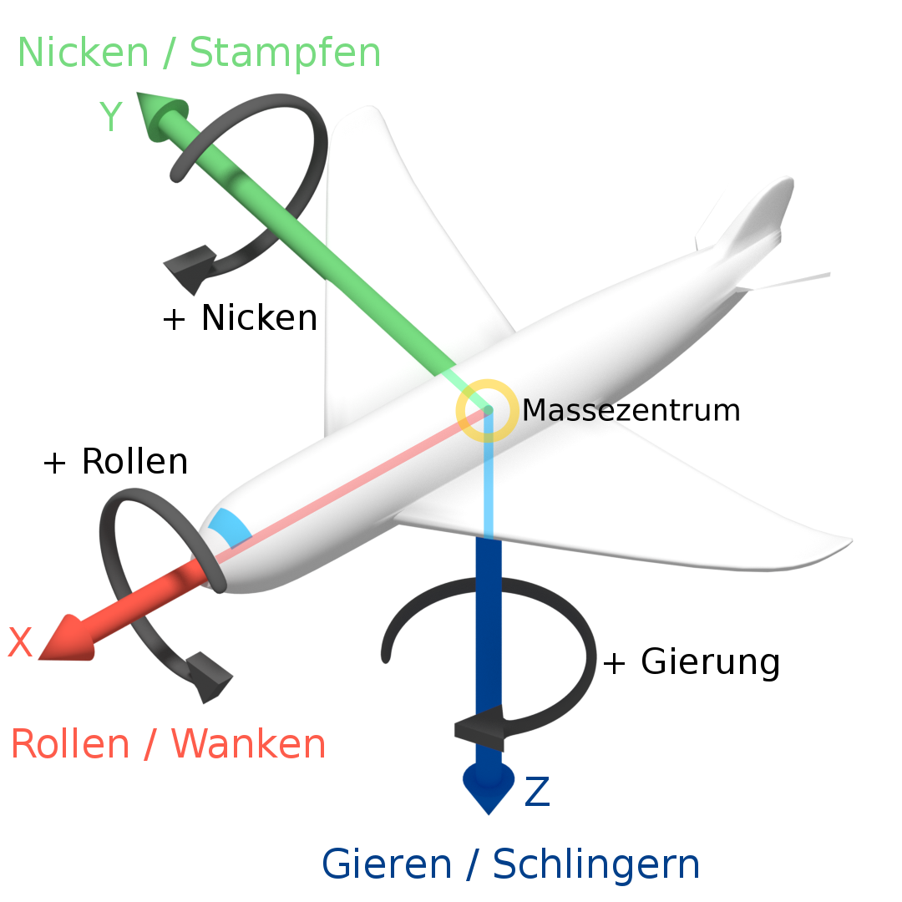
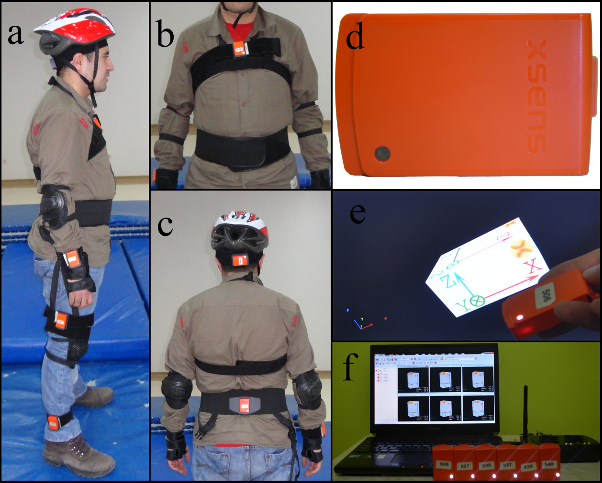

------------------------------------------------------------------------

```{r setup, include=FALSE}
knitr::opts_chunk$set(echo = TRUE, warning = FALSE, message = FALSE)
```

# Datengrundlage

Diese Arbeit basiert auf Daten, welche im Juni 2018 dem Machine Learning Repository der UCI (University of California, Irvine) gespendet wurden. Die Daten wurden von Özdemir, A.T. und Barshan, B. publiziert in *"Detecting Falls with Wearable Sensors Using Machine Learning Techniques.", Sensors 2014, 14, 10691-10708. Results: Six different machine learning algorithms were employed and 100% sensitivity was achieved with k-NN algorithm.*\
Die Daten sind verfügbar unter: <https://archive.ics.uci.edu/ml/datasets/Simulated+Falls+and+Daily+Living+Activities+Data+Set>

Die Daten wurden mit Hilfe von 17 Personen (10 Männern und 7 Frauen) generiert, welche Sensoren am Körper getragen haben. Es wurden 20 Stürze und 16 alltägliche Bewegungsabläufe durchgeführt. Jedes Bewegungsmuster wurde ca. 5 Mal wiederholt und jeder Durchlauf wurde mittels 6 Sensoren am Körper der Probandinnen und Probanden aufgezeichnet.

Es stehen somit 3060 Messungen, jeweils mit einer zeitlichen Auflösung von 25 Hz zur Verfügung.

Ziel der Erhebung dieser Daten war es, mittels maschinellem Lernen Stürze von alltäglichen Bewegungen zu unterscheiden, was in obenstehender Publikation untersucht wurde.

------------------------------------------------------------------------

## Struktur der Daten

Pro Person gibt es einen Dateiordner. Darin sind Unterordner mit den 36 Bewegungsmustern. Schliesslich ist pro Durchlauf ein Ordner vorhanden. Darin befinden sich 6 Textdateien, welche jeweils einem Sensor entsprechen und die Messwerte im zeitlichen Verlauf enthalten. Die Ordner der Bewegungsmuster sind in türkischer Sprache beschriftet. Zur eindeutigen Identifikation von Ordnern und Dateien, sind jedoch all diese zusätzlich mit Zahlen beschriftet. Einen Auflösungsschlüssel dazu, sowie weitere Angaben zu den Daten sind der Dokumentation im Machine Learning Repository zu entnehmen sowie soweit nötig untenstehend aufgeführt.

📁 Person -\> 📁 Bewegungsmuster -\> 📁 Durchlauf -\> 📄 Textdatei des Sensors

------------------------------------------------------------------------

## Bewegungsmuster

20 Stürze

-   901 front-lying, from vertical falling forward to the floor
-   902 front-protecting-lying, from vertical falling forward to the floor with arm protection
-   903 front-knees, from vertical falling down on the knees
-   904 front-knees-lying, from vertical falling down on the knees and then lying on the floor
-   905 front-quick-recovery, from vertical falling on the floor and quick recovery
-   906 front-slow-recovery, from vertical falling on the floor and slow recovery
-   907 front-right, from vertical falling down on the floor, ending in right lateral position
-   908 front-left, from vertical falling down on the floor, ending in left lateral position
-   909 back-sitting, from vertical falling on the floor, ending sitting
-   910 back-lying, from vertical falling on the floor, ending lying
-   911 back-right, from vertical falling on the floor, ending lying in right lateral position
-   912 back-left, from vertical falling on the floor, ending lying in left lateral position
-   913 right-sideway, from vertical falling on the floor, ending lying
-   914 right-recovery, from vertical falling on the floor with subsequent recovery
-   915 left-sideway, from vertical falling on the floor, ending lying
-   916 left-recovery, from vertical falling on the floor with subsequent recovery
-   917 rolling-out-bed, from lying, rolling out of bed and going on the floor
-   918 podium, from vertical standing on a podium going on the floor
-   919 syncope, from standing falling on the floor following a vertical trajectory
-   920 syncope-wall, from standing falling down slowly slipping on a wall

16 alltägliche Bewegungsmuster

-   801 walking-fw, walking forward
-   802 walking-bw, walking backward
-   803 jogging, running
-   804 squatting-down, squatting, then standing up
-   805 bending, bending about 90 degrees
-   806 bending-pick-up, bending to pick up an object on the floor
-   807 limp, walking with a limp
-   808 stumble, stumbling with recovery
-   809 trip-over, bending while walking and then continuing walking
-   810 coughing-sneezing, coughing or sneezing
-   811 sit-chair from vertical, to sitting with a certain acceleration onto a chair (hard surface)
-   812 sit-sofa from vertical, to sitting with a certain acceleration onto a sofa (soft surface)
-   813 sit-air from vertical, to sitting in the air exploiting the muscles of legs
-   814 sit-bed from vertical, to sitting with a certain acceleration onto a bed (soft surface)
-   815 lying-bed, from vertical lying on the bed
-   816 rising-bed, from lying to sitting

------------------------------------------------------------------------

## Sensordaten

Bei den Messinstrumenten handelt es sich um tragbare Bewegungssensoren (genannt MTw) [@özdemir2014], welche mittels Accelerometer (Beschleunigungsmessung), Gyroskop (Lagemessung) und Magnetometer/Kompass, die Bewegungsmuster der Personen erfassen. In der untenstehenden Tabelle sind die Beschreibungen der erfassten Werte (und einigen mehr) aufgeführt.

|                     |                                                                                                                                |                                                       |                |
|-------------|-----------------------------------|-------------|-------------|
| **Abbreviation**    | **Data**                                                                                                                       | **Unit**                                              | **In dataset** |
| PacketCounter       | Sample counter                                                                                                                 | (-), wraps at 65535                                   | yes            |
| StatusWord          | 32-bit status, see Section 11.8 for information on the Status Word                                                             | N/A                                                   | no             |
| Clipping Flags      | 0 refers to no clipping. 1 indicates that a sensor component clipped. This data is a selection of the StatusWord output.       | N/A                                                   | no             |
| RSSI                | Received Signal Strength Indicator by Master from each connected MTw                                                           | dBm                                                   | yes            |
| Acc_X               | Acceleration x-axis                                                                                                            | m/s2                                                  | yes            |
| Acc_Y               | Acceleration y-axis                                                                                                            | m/s2                                                  | yes            |
| Acc_Z               | Acceleration z-axis                                                                                                            | m/s2                                                  | yes            |
| FreeAcc_X           | Acceleration minus gravity, x axis                                                                                             | m/s2                                                  | no             |
| FreeAcc_Y           | Acceleration minus gravity, y axis                                                                                             | m/s2                                                  | no             |
| FreeAcc_Z           | Acceleration minus gravity, z axis                                                                                             | m/s2                                                  | no             |
| Gyr_X               | Angular rate x-axis                                                                                                            | rad/s                                                 | yes            |
| Gyr_Y               | Angular rate y-axis                                                                                                            | rad/s                                                 | yes            |
| Gyr_Z               | Angular rate z-axis                                                                                                            | rad/s                                                 | yes            |
| Mag_X               | Magnetic field x-axis                                                                                                          | arbitrary unit; magnetic field strength at Xsens is 1 | yes            |
| Mag_Y               | Magnetic field y-axis                                                                                                          | arbitrary unit; magnetic field strength at Xsens is 1 | yes            |
| Mag_Z               | Magnetic field z-axis                                                                                                          | arbitrary unit; magnetic field strength at Xsens is 1 | yes            |
| VelInc_X            | Velocity increment from SDI, x-axis                                                                                            | m/s                                                   | yes            |
| VelInc_Y            | Velocity increment from SDI, y-axis                                                                                            | m/s                                                   | yes            |
| VelInc_Z            | Velocity increment from SDI, z-axis                                                                                            | m/s                                                   | yes            |
| OriInc_w            | Orientation increment quaternion from SDI, real component                                                                      | Unit quaternion                                       | yes            |
| OriInc_x            | Orientation increment quaternion from SDI, x-axis                                                                              | Unit quaternion                                       | yes            |
| OriInc_y            | Orientation increment quaternion from SDI, y-axis                                                                              | Unit quaternion                                       | yes            |
| OriInc_z            | Orientation increment quaternion from SDI, z-axis                                                                              | Unit quaternion                                       | yes            |
| Pressure            | Atmospheric pressure                                                                                                           | Pa                                                    | yes            |
| Roll/Pitch/Yaw      | Orientation Euler angles format (3)                                                                                            | deg                                                   | yes            |
| Quat                | Orientation quaternion format (4)                                                                                              | Unit quaternion                                       | no             |
| Mat [R#][C#]        | Rotation matrix format [Row][Column] (3x3). (Direction Cosine matrix)                                                          | Unit vectors                                          | no             |
| TrigIn1_Polarity    | Polarity of the received signal                                                                                                | 1: Rising Edge 2: Falling Edge 3: Both                | no             |
| TrigIn1_Timestamp   | The time stamp of the trigger Awinda converted time stamp values of trigger indications sent to SyncIn 1 of the Awinda Station | Milliseconds                                          | no             |
| TrigIn1_Framenumber | The frame number in which the trigger was received                                                                             | N/A                                                   | no             |
| TrigIn2_Polarity    | Polarity of the received signal                                                                                                | 1: Rising Edge 2: Falling Edge 3: Both                | no             |
| TrigIn2_Timestamp   | The time stamp of the trigger Awinda converted time stamp values of trigger indications sent to SyncIn 2 of the Awinda Station | Milliseconds                                          | no             |
| TrigIn2_Framenumber | The frame number in which the trigger was received                                                                             | N/A                                                   | no             |

: Tabelle 1 - Beschreibung der von den Sensoren erfassten Daten gemäss "MTw Awinda User Manual", Document MW0502P, Revision L, 3 May 2018, Xsens Technologies B.V. Enschede, The Netherlands, 2014. Available online: <http://www.xsens.com> (aufgerufen am 06. Mai 2023).

## Erläuterung einiger Sensordaten

### Acc/Mag/Gyr

Gemäss dem obengenannten "MTw Awinda User Manual" kann mittels der Daten des Accelero- (Acc_X, -Y, -Z) und des Magnetometers (Mag_X, -Y, -Z) die Orientierung eines sich nicht bewegenden Sensors im dreidimensionalen Raum berechnet werden. Die Daten werden dabei jeweils in den drei Achsen X, Y und Z gemessen. Die genaue Ausrichtung dieser Achsen in Bezug zum Sensor wird in genannter Anleitung genauer erläutert und ist abhängig von Anpassungen vor den Messversuchen. Die Orientierung eines sich in Bewegung befindenden Sensors kann durch zusätzliche Betrachtung der Daten des Gyroskops (Gyr_X, -Y, Z) errechnet werden, was Sensorfusion genannt wird. Diese Sensorfusion kann durch den Algorithmus XKF3hm (Xsens Kalman Filter for 3 degrees-of-freedom orientation for Human Motion) erreicht werden. Dieser Algorithmus versucht Effekte, welche zu einem Abweichen der errechneten von der tatsächlichen Position und Orientierung der Sensoren, wie beispielsweise bei einer kontinuierlichen Beschleunigung, durch Annahmen der Bewegungsdynamik und der Sensorcharakteristika zu minimieren. Die Details dieses Algorithmus werden im Rahmen dieses Projektes nicht genauer betrachtet.

### Roll/Pitch/Yaw

Bei den Daten, welche unter Roll, Pitch und Yaw erfasst sind, handelt es sich um Winkel. Ursprünglich wurden diese Winkel in der Aviatik verwendet zur Beschreibung der Lage eines Flugzeuges im dreidimensionalen Raum [@roll-nic2021]. Nachfolgend ist illustriert, wie diese Winkelangaben zu verstehen sind (roll = Rollen, pitch = Nicken, yaw = Gierung).

[{width="40%"}](https://commons.wikimedia.org/w/index.php?curid=66298439)

### Quat

Quaternionen werden, wie die Lagewinkel, zur Orientierung in einem dreidimensionalen Raum verwendet. Sie sind insbesondere für Berechnungen, die abhängig von der Lage eines Objektes sind, wichtig und werden beispielsweise in Software von Smartphones verwendet, welche sich dessen Sensorik zu Nutze machen [@3blue1brown2018].

------------------------------------------------------------------------

## Lokalisierung der Sensoren

Es wurden folgende Sensoren am Körper angebracht. Die Nummer in Klammern repräsentiert den Unterordner, in denen die Test-Dateien mit den Messdaten abgelegt sind.

-   Head sensor (340506)
-   Chest sensor (340527)
-   Waist sensor (340535)
-   Right wrist sensor (340537)
-   Right thigh sensor (340539)
-   Right ankle sensor (340540)

{width="70%"}

------------------------------------------------------------------------

# Import der Daten nach R

Für die Datenaufbereitung arbeiten wir mit mehreren R-Packages aus der `tidyverse` Familie. Während der kollaboriativen Projektarbeit, haben wir den Pfad zu den lokal gespeicherten Daten (`path_data`) abhängig vom User, der das Skript ausführt, generiert. Für dieses Markdown-Dokument haben wir uns auf Beispieldaten (ca. 20 MB) aus dem ursprünglichen Datensatz (ca. 1.2 GB) beschränkt, damit das Projekt inklusive Daten abgegeben werden kann. Die Beispieldaten sind im Projektverzeichnis `sample_data` hinterlegt.

```{r libraries and options, message=FALSE}
library(tidyverse)
library(dplyr)
library(gridExtra)
library(grid)
library(scales)

# Set options and path ----
options(digits = 20)
path_data <- "sample_data/"
```

Für den Import der Text-Dateien wird eine relevante Dateiliste erstellt. Die einzelnen txt-Dateien werden mit einem For-Loop in R eingelesen und in einem Data-Frame zusammengefasst.

```{r probanden datengrundlage}
# extract person-data from Bilgi.txt files; "bilgi" is Turkish for "information" ----
all_bilgi <- paste0(path_data, list.files(path_data, recursive = TRUE, pattern = 'Bilgi.txt'))
bilgi<-data.frame()
for (i in all_bilgi) {
  tmp <- read.table(i, header=FALSE, sep = ":")
  tmp <- cbind(str_sub(str_sub(i, -13,-1),1,3), tmp)
  bilgi <- rbind(bilgi,tmp)
}
rm(tmp,i)
```

## Proband\*innen

Die Verteilung der Proband\*innen präsentiert sich wie folgt.

```{r probanden verteilung}
# clean / tidy the bilgi dataset
colnames(bilgi) <- c("person_nr", "attr", "value")
bilgi$value <- sub(" kg","",bilgi$value)
bilgi$value <- sub(" cm","",bilgi$value)
bilgi$value <- gsub(" ","",bilgi$value)
bilgi$attr <- gsub(" ","",bilgi$attr)

# show bilgi-table in wide format (one row per person)
bilgi <- pivot_wider(data = bilgi ,  names_from = "attr", values_from = "value")
colnames(bilgi) <- gsub(" ", "", colnames(bilgi))
bilgi$Weight <- as.numeric(bilgi$Weight)
bilgi$Height <- as.numeric(bilgi$Height)
bilgi$Age <- as.numeric(bilgi$Age)
bilgi
```

Es gibt `r nrow(bilgi[bilgi$Gender=="Male",])` Probanden und `r nrow(bilgi[bilgi$Gender=="Female",])` Probandinnen. Das Alter liegt zwischen `r min(bilgi$Age)` und `r max(bilgi$Age)` Jahren mit dem Mittelwert von rund `r round(mean(bilgi$Age))` Jahren.

## Grafischer Überblick

Für die Datenanalyse haben wir uns einen umfangreichen Überblick über die vorhandenen Daten verschafft. Zunächst haben wir die gesamten Sensordaten einer Person in ein Data Frame geladen. Dies waren etwas über 550'000 Zeilen und 21 numerische Spalten. Einige Sensordaten hatten eine Präzision von 19 Nachkommastellen. Teilweise wurden die entsprechenden Messwerte auf 18 Nachkommastellen gerundet, weil der R-Datentyp `numeric` nur 64 Bit speichert. Wir haben uns aus praktischen Gründen für die (teilweise) gerundeten Werte entschieden, um mit den `numeric`-Werten zu arbeiten.

```{r messwerte datengrundlage}
# define path for person 101
path_data_import <- paste0(path_data, "101", "/Testler Export/")

# extract file-list with sensor-data from path and subdirectories (with sample data)
all_value_files <- paste0(path_data_import,
                          list.files(path_data_import, recursive = TRUE, pattern = '[0-9]{6}.txt'))

# load data
test_data <- data.frame()
for (i in all_value_files) {
  tmp <- read.table(i
             , header=TRUE               # get column names
             , sep= "\t"                 # tab as seperator
             # , numerals = "no.loss"      # numeric with litte loss in precision
             , comment.char="/"          # first 4 rows are not relevant
  )
  tmp <- cbind(i, tmp)                   # bind subdirectory to data
  test_data <- rbind(test_data, tmp)     # bind rows of all files to one data-frame
}
rm(tmp,i)

# creating calculated columns to divide the sensor data in groups
test_data$i <- sub(path_data,"",test_data$i)
names(test_data)[names(test_data) == "i"] <- c("sub_directory")
test_data <- select(test_data, -"X")
sub_dir_names <- c("bilgi_nr", "not_relevant", "type", "test_nr", "sensor")
test_data[sub_dir_names] <- str_split_fixed(test_data$sub_directory, "/", 5)
test_data[c("type_nr", "type_name")] <- str_split_fixed(test_data$type, "-", 2)
test_data$sensor_nr <- sub(".txt","",test_data$sensor)

# Definition of the sensors
sensor_mapping <- data.frame(sensor_nr = c("340506", "340527", "340535", "340537", "340539", "340540"),
                             sensor_name = c("Head", "Chest", "Waist", "Wrist", "Thigh", "Ankle"))
test_data <- test_data %>% 
  left_join(sensor_mapping, by = c("sensor_nr"="sensor_nr"))

# delete not nessesary data
test_data$not_relevant<-NULL
test_data$type<-NULL
test_data$sub_directory<-NULL
test_data$sensor<-NULL
```

Als nächstes haben wir mehrere Grafiktypen ausprobiert, um die Daten besser zu verstehen. Zeitreihen-Grafiken mit `ggplot2` vermitteln einen guten Eindruck der Daten. Die Messpunkte können für die Zeitreihe als Punkt- oder Liniengrafik dargestellt werden. Die Punktgrafiken stellen zwar die vorliegenden Daten "korrekter" dar. Allerdings vermitteln die Liniengrafiken den Verlauf der Daten besser, weil die einzelnen Datenpunkte verbunden sind. Jede Linie repräsentiert einen Sensor im zeitlichen Verlauf (X-Achse in Abbildungen). Auf der Y-Achse werden die verschiedenen Messwerte gezeichnet, wie beispielswiese "Magnetic field y-axis" (Mag_Y) in der folgenden Abbildung. Beim Sturz 910 (Type 910) handelt es sich um einen senkrechten Fall auf den Boden bis zum Liegen in Rückenlage.

```{r grafiken einsteig}
tmp <- test_data %>% filter(type_nr == "910", test_nr == "Test_2")
ggplot(tmp, aes(x = Counter, y = Mag_Y , colour = sensor_name)) +
  geom_point(size=1) +
  ggtitle(paste0("Person ", unique(tmp$person_nr), ", Type ", unique(tmp$type_nr), ", ", unique(tmp$test_nr))) +
  guides(x = "none") +
  labs(x = "time")
```

Für einem umfassenden Überblick über alle Bewegungsmuster, Tests und Messwerte wurden die Testdaten im Long-Format dargestellt und mit einem dreifach verschachtelten For-Loop insgesamt 4'137 Bilder erstellt. Eine Auswahl an Abbildungen repräsentieren unsere ersten Erkenntnisse.

An den ersten beiden Abbildungen ist erkennbar, dass die Daten bei wiederholten Tests des gleichen Bewegungsmusters (919: Synkope, aus dem Stand in vertikaler Flugbahn auf den Boden fallen) sehr ähnlich sind. Sie weisen jedoch auch Unterschiede auf, z.B. weil der "Zacken" der grünen untersten Linie im Test_3 weniger stark ausgeschlagen ist. In den unteren beiden Grafiken sind andere Bewegungsmuster dargestellt, was in ganz anderen Mag_Y-Messkurven resultiert. Beim Bewegungsmuster 801 handelt es sich um Vorwärtslaufen und bei 908 um einen Sturz aus der Senkrechten nach vorne links, bei dem die Person in der linken Seitenlage zum Liegen kommt.

```{r ausgewählte grafiken teil 1}

# definition of plot examples
pics <- data.frame(type=c("919", "919", "801", "908"),
          test=c("Test_4", "Test_3", "Test_1", "Test_2"))

# loop to create the example plots
for (i in 1:nrow(pics)) {
  tmp <- test_data %>% filter(type_nr == pics[i,"type"], test_nr == pics[i,"test"])
  assign(paste0("plot",i),
         ggplot(tmp, aes(x = Counter, y = Mag_Y , colour = sensor_name)) +
           geom_line(size = 1, show.legend = FALSE) +
           ggtitle(paste0("Person ", unique(tmp$person_nr), ", Type ", pics[i,"type"], ", ", pics[i,"test"])) +
           guides(x = "none") +
           labs(x = NULL)
         )
}

# show the plots
grid.arrange(plot1, plot2, plot3, plot4, nrow=2, ncol=2)

```

Bei ein und demselben Bewegungsmuster und Test liegen uns 21 unterschiedliche Messwerte vor. Die folgenden vier Bilder zeigen eine Auswahl der Vielfalt der Datenreihen. Der Sturz 904 ist ein Sturz auf die Knie und dann auf den Boden. Die Messwerte liegen teilweise "übereinander" oder weisen nach dem Sturz gleiche Werte auf. Oft verändern sich jedoch das "Niveau". Beispielsweise lag der Chest-Sensor-Wert von "Roll" vor dem Sturz bei rund -120 und danach bei rund 80.

```{r ausgewählte grafiken teil 2}

# data to long format
colprint <- grepl("_[wxyzXYZ]" , colnames(test_data)) | colnames(test_data) %in% c("Pressure", "Roll", "Pitch", "Yaw", "RSSI")
colprint_names <- colnames(test_data[,colprint])
test_data_long <- test_data %>%
  pivot_longer(cols = all_of(colprint_names))

# but here we only need one type and test...
tmp_long <- test_data_long %>% filter(type_nr == "904", test_nr == "Test_3")

# ... to loop through four different mesurement values
kpis <- c("Roll", "Pitch", "OriInc_y", "Acc_Y")
i<-5
for (cp in kpis) {
  tmp <- filter(tmp_long, name == cp)
  assign(paste0("plot",i),
         ggplot(tmp, aes(x = Counter, y = value , colour = sensor_name)) +
           geom_line(size = 1, show.legend = FALSE) +
           ggtitle(paste0("Person ", unique(tmp$person_nr), ", Type ", unique(tmp$type_nr), ", ", unique(tmp$test_nr))) +
           guides(x = "none") +
           labs(x = NULL, y = cp) + 
           scale_y_continuous(labels = label_comma(accuracy = 1))
         )
  i<-i+1
}

# show the plots
grid.arrange(plot5, plot6, plot7, plot8, nrow=2, ncol=2)

```

## Interpretation

Zur Visualisierung und Interpretation der Daten in R ohne Zuhilfenahme von zusätzlicher Software, fokussieren wir uns auf die Beschleunigungsdaten in drei Achsen (Acc_X-Z). Die Auswahl dieser Daten ist mit der für uns guten Nachvollziehbarkeit der Messungen im Testsetting begründet.

Die genannten Daten werden für zwei Bewegungen, eine alltägliche und ein Sturzereignis, betrachtet:

-   811 - Aus stehender Position auf eine harte Oberfläche (Stuhl) absitzen mit einer gewissen Beschleunigung

-   919 - Aus stehender Position in einer vertikalen Richtung auf den Boden fallen im Sinne einer Synkope (transienter Bewusstseinsverlust)

Wir haben uns für diese beiden Bewegungen entschieden, weil sie sich vor allem in der Vertikalen abspielen und recht abrupt Enden (durch das Sitzen auf einer nicht federnden, harten Oberfläche und das Austreffen am Boden) und eine Unterscheidung, bspw. für automatische Alarmierungssysteme, enorm wichtig ist.

```{r grafik interpretation acceleration 1}
# reduce data to one movement and one test
tmp <- test_data %>%
  filter(type_nr == "919", test_nr == "Test_1")
# plots of acceleration in all axes
axes <- c("Acc_X","Acc_Y","Acc_Z")
double_prec <- function(x) sprintf("%.2f", x) # func for reducing digits on y axis
plot_axes = function (data, axes) {
    ggplot(tmp, aes(x = Counter, y = tmp[,axes], colour = sensor_name)) +
      geom_line(size = 0.5, show.legend = FALSE) +
      labs(x = "Zeit [Counter]", y = axes) +
      scale_y_continuous(labels=double_prec)
}
plot_list <- lapply(axes, plot_axes, data = tmp)
t <- textGrob("Beschleunigung (Accelerometer)\nin der X-, Y- und Z-Achse\nProband 101\nBewegung: Synkope\nTest 1")
g1 <- arrangeGrob(grobs = plot_list)
grid.arrange(t, plot_list[[1]], plot_list[[2]], plot_list[[3]], nrow=2, ncol=2)
# Einheit (m/s^2) an Y-Achse jeweils anbringen hat mit paste() und bquote() nicht funktioniert, da diese ausserhalb von lapply evaluiert werden.

```

Wir sehen, dass die Beschleunigung (m/s^2^) je nach Sensor mit sehr unterschiedlichen Messwerten abgebildet wird. Das ist einerseits dadurch erklärbar, dass sich einige Körperregionen bei der Bewegung unterschiedlich schnell und in verschiedene Richtungen bewegen (ein Arm kann relativ zum Körper nach hinten geworfen werden und der Rest vom Körper fällt zu Boden), andererseits weisen die Sensoren unterschiedliche Ausgangpositionen auf (siehe Bild 2). Der Verlauf der Messwerte lässt sich anhand der drei obenstehenden Grafiken mit den sechs sich überlagernden Sensoren aber nicht gut beurteilen. Deshalb haben wir uns entschieden, uns auf den Sensor am Handgelenk zu fokussieren. Dieser ist in seiner Position einer alltäglich angewendeten Fitnessuhr / Smartwatch am nächsten und somit auch ausserhalb des Testsettings eher von Bedeutung.

```{r grafik interpretation acceleration 2}
movements <- c("919", "811")
multi_movements = function (data, movements) {
# reduce data to one movement, one test and one sensor
tmp <- test_data %>%
  filter(type_nr == movements, test_nr == "Test_1", sensor_name == "Wrist")

# use 'Counter' to calculate time in seconds
lowest <- min(tmp$Counter)
tmp <- tmp %>%
  mutate(ms = (Counter - lowest) * 0.04) # 25 Hz -> (Counter * 40) / 1000

# remove first 35 % and last 20 % of measurements to focus on time segment
tmp <- tmp %>%
  slice(floor((nrow(tmp))*0.35):floor((nrow(tmp))*0.80))

# plots of acceleration in all axes
axes <- c("Acc_X","Acc_Y","Acc_Z")
double_prec <- function(x) sprintf("%.2f", x) # func for reducing digits on y axis
plot_axes = function (data, axes) {
    ggplot(tmp, aes(x = ms, y = tmp[,axes], colour = sensor_name)) +
      geom_line(size = 0.5, show.legend = FALSE) +
      labs(x = "Zeit [s]", y = axes) +
      scale_y_continuous(labels=double_prec)
}
partial_plot_list <- lapply(axes, plot_axes, data = tmp)
t <- paste0("Beschleunigung (Accelerometer)\nin der X-, Y- und Z-Achse\nProband 101\nBewegung: ", movements, "\nTest 1") %>% textGrob()
movement_plot <- arrangeGrob(t, partial_plot_list[[1]], partial_plot_list[[2]], partial_plot_list[[3]], nrow=4)
}
combined_plot_list <- invisible(lapply(movements, multi_movements, data = test_data)) # invisible() is necessary to suppress text output from lapply
grid.arrange(combined_plot_list[[1]],combined_plot_list[[2]], ncol=2)
```

Wenn wir die beiden Bewegungen vergleichen, können wir mehrere Beobachtungen feststellen:

-   Das Absitzen dauerts ca. 4 Sekunden (bei 25 Hz: Counter \* 40 / 1000) und der synkopale Sturz \< 2 Sekunden.

-   Anhand der Steigungen sehen wir, dass der Sturz deutlich abrupter stattfindet. Insbesondere ist beim Anfang der Bewegung eine stärkere und rascher zunehmende Beschleunigung zu sehen. Was beim Absitzen an Abruptheit zu sehen ist, findet vor allem zum Ende der Bewegung statt, was durch das Auftreffen des Körpers auf der harten Oberfläche, dem Stuhl, zu erklären ist.

-   Das Maximum der Beschleunigungen sind beim Sturzereignis deutlich grösser, mit bis zu 25 m/s^2^ in der Z-Achse, im Vergleich zu ca. 10 m/s^2^ beim Absitzen. Somit kann hier schon gezeigt werden, dass zumindest auf das Handgelenk, \> 2.5 G (Erdbeschleunigung 9.81 m/s^2^) wirken.

-   Die unterschiedlichen "stabilen" Beschleunigungen nach Ende der Bewegungen sind durch die unterschiedliche Endlage der Sensoren anzunehmen. Bei unterschiedlicher Lage wirkt die Erdbeschleunigung in unterschiedlichem Ausmass in den drei Achsen der Sensoren. Die Ausgangslage der Sensoren am Handgelenk ist mit annährend 9 m/s^2^ in X-Achse, -3 - -4 m/s^2^ in der Y-Achse und 1-2 m/s^2^ in der Z-Achse in etwa der Abbildung 2 entsprechend anzunehmen.

# Diskussion

An dieser Stelle möchten wir gerne auf einige wichtige Punkte eingehen.

Wir haben die Plots zur Darstellung der Daten auf unterschiedliche Weise erzeugt: mit For-Loops und mit der `lapply`-Funktion. Die Plots im Kapitel [Grafischer Überblick] wurden vorwiegend mit For-Schleifen, diejenigen des Kapitels [Interpretation] mittels der `lapply`-Funktion realisiert. Untenstehend sind Codeauszüge zur Veranschaulichung.

``` r
### For-Schleife
-----------------
for (i in 1:nrow(pics)) {
  tmp <- test_data %>% filter(type_nr == pics[i,"type"], test_nr == pics[i,"test"])
  assign(paste0("plot",i),
         ggplot(tmp, aes(x = Counter, y = Mag_Y , colour = sensor_name)) +
           geom_line(size = 1, show.legend = FALSE) +
           ggtitle(paste0("Person ", unique(tmp$person_nr), ", Type ", pics[i,"type"], ", ", pics[i,"test"])) +
           guides(x = "none") +
           labs(x = NULL)
         )
}
grid.arrange(plot1, plot2, plot3, plot4, nrow=2, ncol=2)

### lapply-Funktion
-------------------
movements <- c("919", "811")
multi_movements = function (data, movements) {
# reduce data to one movement, one test and one sensor
tmp <- test_data %>%
  filter(type_nr == movements, test_nr == "Test_1", sensor_name == "Wrist")
# plots of acceleration in all axes
axes <- c("Acc_X","Acc_Y","Acc_Z")
plot_axes = function (data, axes) {
    ggplot(tmp, aes(x = ms, y = tmp[,axes], colour = sensor_name)) +
      geom_line(size = 0.5, show.legend = FALSE) +
      labs(x = "Zeit [s]", y = axes) +
      scale_y_continuous(labels=double_prec)
}
partial_plot_list <- lapply(axes, plot_axes, data = tmp)
t <- paste0("Beschleunigung (Accelerometer)\nin der X-, Y- und Z-Achse\nProband 101\nBewegung: ", movements, "\nTest 1") %>% textGrob()
movement_plot <- arrangeGrob(t, partial_plot_list[[1]], partial_plot_list[[2]], partial_plot_list[[3]], nrow=4)
}
combined_plot_list <- invisible(lapply(movements, multi_movements, data = test_data)) # invisible() is necessary to suppress text output from lapply
grid.arrange(combined_plot_list[[1]],combined_plot_list[[2]], ncol=2)
```

Im Verlauf unserer Projektarbeit haben wir festgestellt, dass sowohl die `lapply`-Funktion als auch die For-Schleife für die Erstellung von Plots verwendet werden können. Das Plotten mittels `lapply`-Funktion ist im Vergleich zur Darstellung durch For-Schleifen mit einigen Extraschritten verbunden. Wenn man die durch die `lapply`-Funktion erstellte Liste, welche aus Plots besteht, in einem Grid darstellen will, so ist dies beispielsweise dadurch möglich, indem man entweder die Liste als Ganzes in ein "Grob" (Grid Graphical Object) umwandelt oder in der Liste die entsprechenden Plots mittels Index auswählt (bspw. `plot_liste[[x]]`). Dafür bringt die `lapply`-Funktion den Vorteil, dass das Iterieren über Elemente und das Anwenden von Funktionen darauf vereinfacht wird. Wir haben uns aus didaktischen Gründen entschieden beide Vorgehensweisen im Code zu belassen.

An Ende unserer Analysen sind wir auf das R-Package `esquisse` gestossen, mit dem man Daten interaktiv (per Drag & Drop) mit `ggplot2` analysieren kann. Dadurch kann man einen einfachen Einblick in die Daten erhalten, wenn man diese noch überhaupt nicht kennt. Zudem kann der generierte R-Code übernommen werden, um die `ggplot2`-Grafiken dauerhaft in ein eigenes Projekt zu übernehmen.

```{r, eval=FALSE}
if (!require('esquisse')) install.packages('esquisse')
library('esquisse')
esquisser(your_subset_data)
```

Zusammenfassend können wir anhand der betrachteten Daten gut nachvollziehen, dass Bewegungen mit Daten von getragenen Sensoren unterschieden werden können, wie dies in der Publikation *"Detecting Falls with Wearable Sensors Using Machine Learning Techniques."* von Özdemir AT und Barshan gezeigt wurde. Jedoch bleibt zu Bedenken, dass es sich um simulierte Daten handelt. Selbst wenn die Daten durch die Erfassung von Bewegungen am Menschen erzeugt wurden und bei der Anwendung des mittels Trainingsdaten erzeugten Modells auf erneute Simulationen eine gute Unterscheidbarkeit erreicht werden konnte. Gerade bezogen auf unsere ausgewählten Bewegungsdaten einer Synkope wäre in Realität, also bei einem echten Bewusstseinsverlust mit daraus folgendem Verlust der kompletten Muskelspannung, von noch höheren Beschleunigungswerten in Richtung des Bodens auszugehen. Unser Projekt hat sich nicht mit dem maschinellen Lernen beschäftigt, sondern mit dem Verständnis und der Visualisierung der dazu zugrundeliegenden Daten. Wir denken, dass es wichtig ist, die Ausgangsdaten jeweils zu verstehen um auch nach der Anwendung von Verfahren, wie dem maschinellen Lernen eine fundierte Aussage treffen zu können. Dies gilt unserer Meinung nach insbesondere dann, wenn Verarbeitungs- und Analyseverfahren von Daten immer komplexer werden.

------------------------------------------------------------------------
